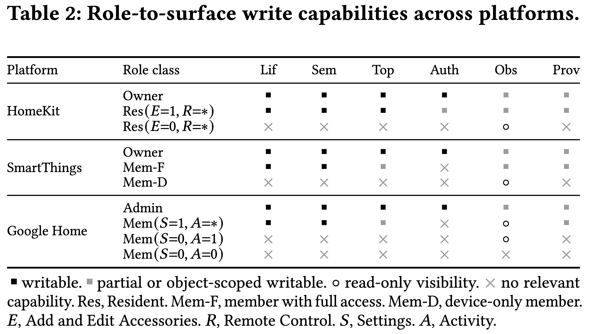
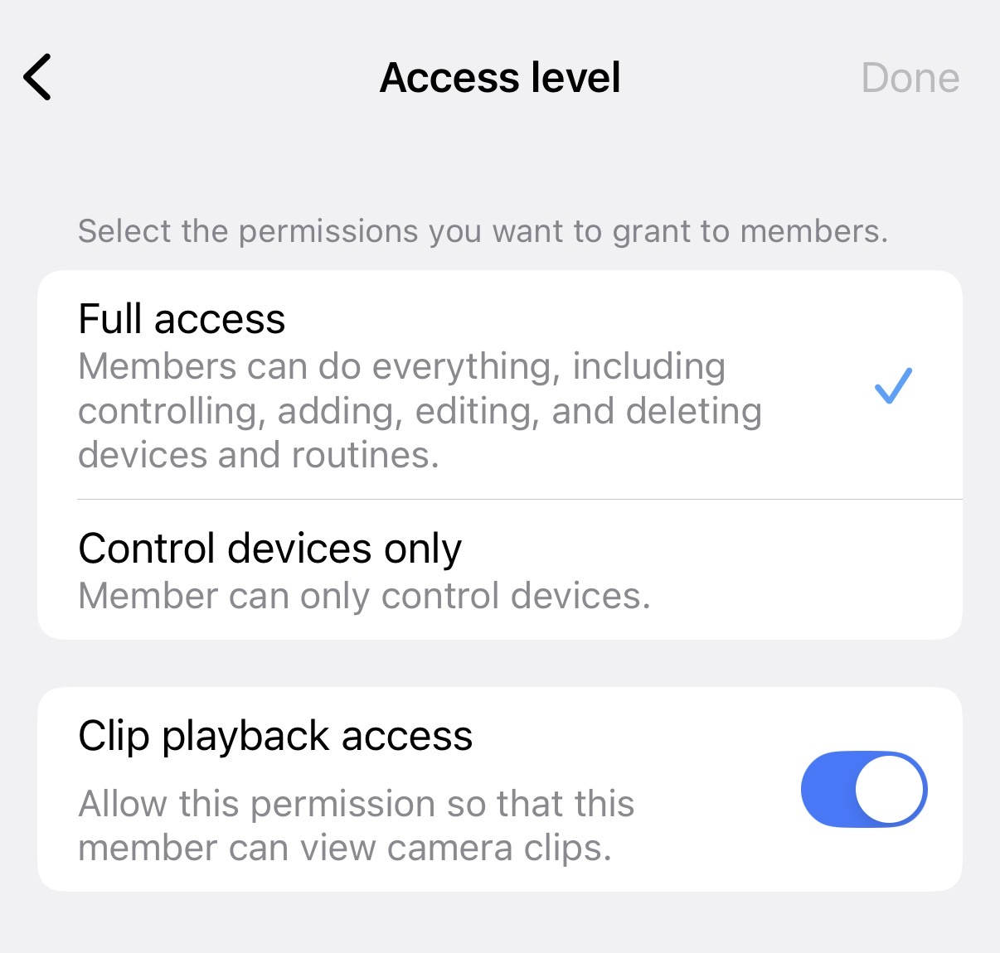
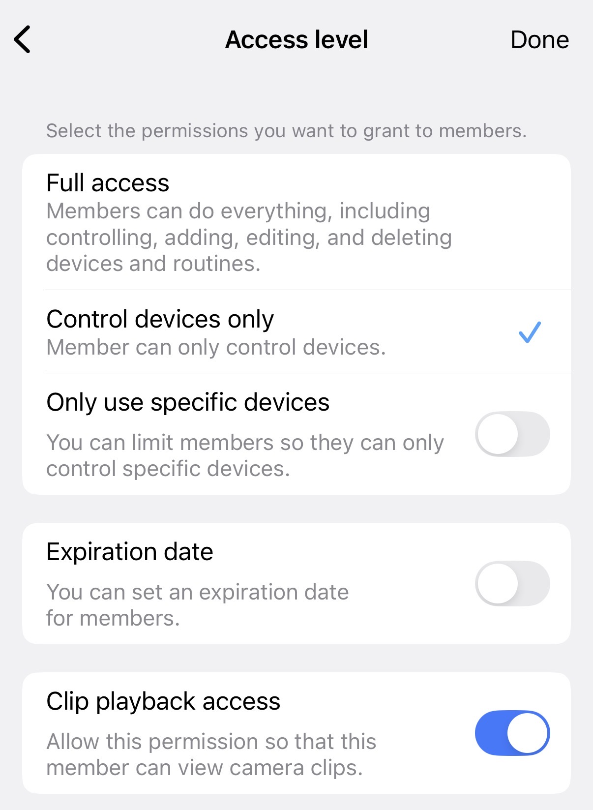
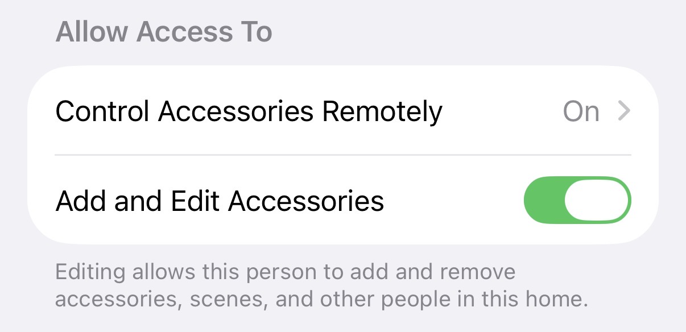
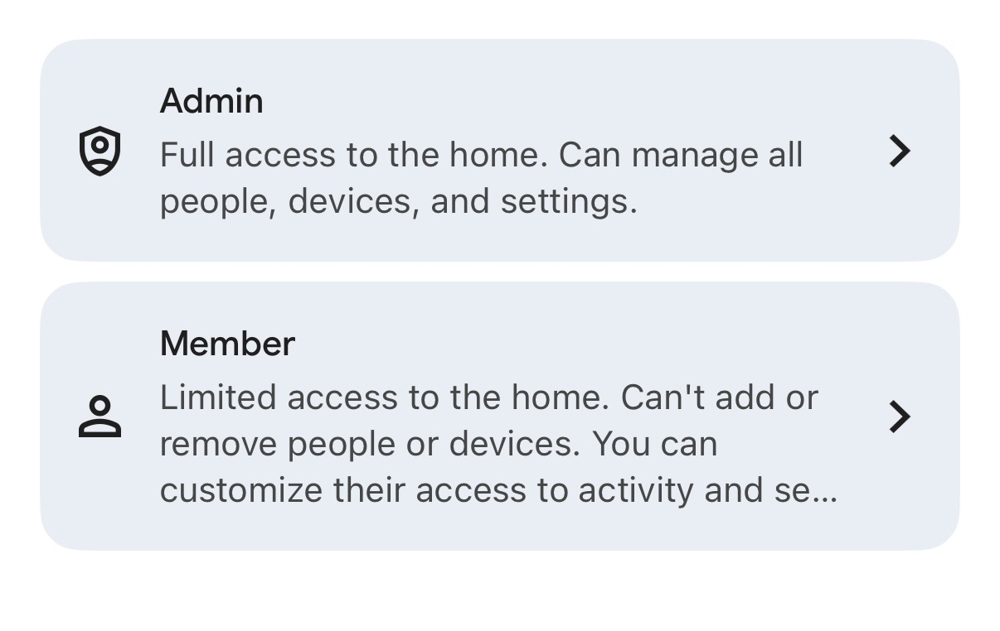
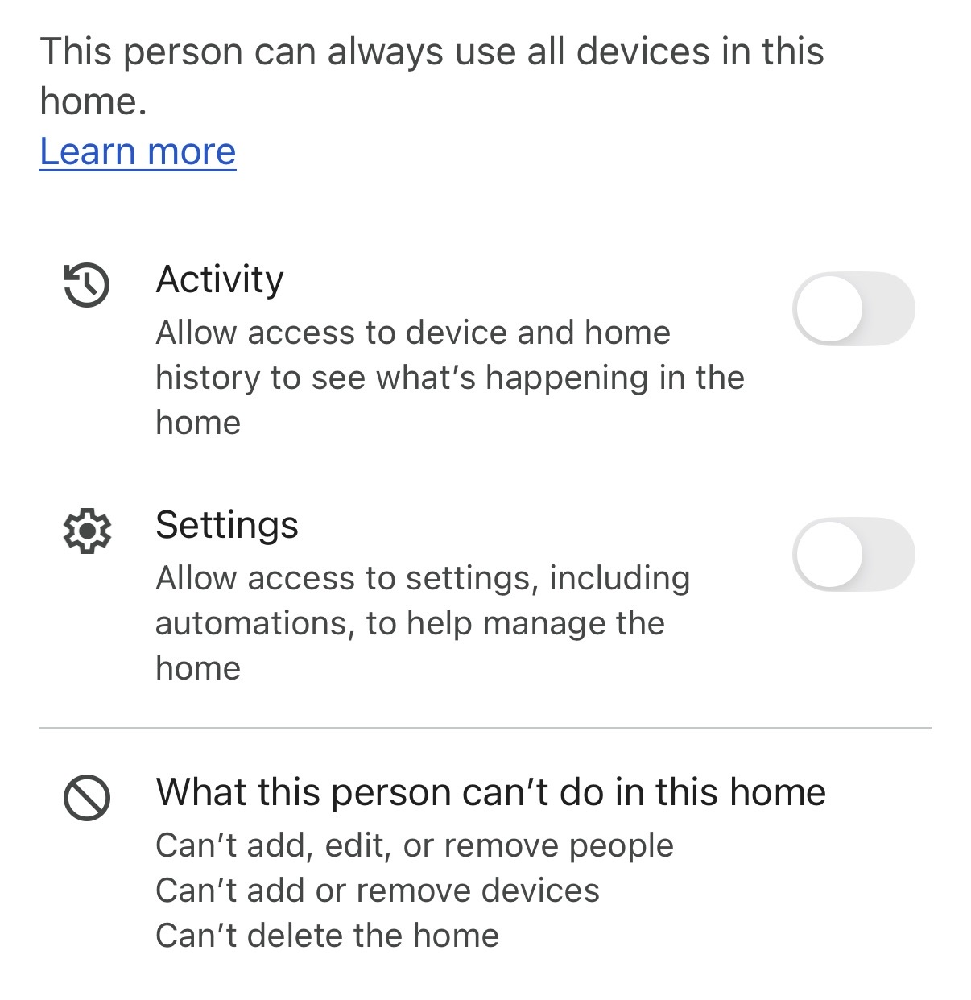

### Role Specification

The table summarizes the role-to-surface write capabilities observed in the three platform UIs. We use the screenshots below as artifacts for the role model implemented by each platform: whether a role can manage people, devices, automations, device/history observations, and provenance-like platform settings.

#### SmartThings

SmartThings distinguishes the home owner from invited members. The owner is the full authority for the location and can manage people, devices, and routines/automations.

For invited members, the UI exposes two access levels. "Full access" members can control, add, edit, and delete devices and routines, so they have write access to device and automation surfaces. "Control devices only" members can only operate devices; the optional "Only use specific devices" control can further scope that device access. Clip playback access is configured separately as an observation permission for camera history. These member roles do not provide the same people-management authority as the owner role.

#### HomeKit

HomeKit uses an owner/resident model. The home owner can manage people, accessories/devices, scenes, and automations. Residents are configured with per-person permission switches rather than a single flat member role.

For residents, the relevant sub-permissions are "Control Accessories Remotely" and "Add and Edit Accessories." The remote-control setting determines whether the resident can control the home while away. The add/edit setting grants broader editing power over accessories, scenes, and other people in the home. However, this resident authority remains below the owner authority: a resident cannot change the home owner's permissions or ownership status, although an enabled resident can invite or manage other resident-level users according to the granted editing permission.

#### Google Home

Google Home exposes Admin and Member roles rather than a distinct owner role in this UI. An Admin has full access to the home and can manage people, devices, and settings. In practice, admin authority is peer-like: once a user is invited as an Admin, that user can manage the home membership, including removing the user who originally invited them.

Members have limited access and cannot add or remove people or devices, nor can they delete the home. Member access is customized through two switches. "Activity" grants access to device and home history, which corresponds to observation capability. "Settings" grants access to settings, including automations, which gives the member automation-management capability without people-management authority. The UI also states that a member can always use all devices in the home, so device operation is available even when Activity and Settings are disabled.
